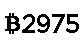

# MicroPython ESP8266 Nokia 5110 Bitcoin Price Index

A MicroPython library for displaying bitcoin price index on a Nokia 5110 display with PCD8544 driver.

Powered by [CoinDesk](http://www.coindesk.com/price/) and their free [Bitcoin Price Index API](http://www.coindesk.com/api/).

Prices are converted to Australian dollars (AUD) using hourly conversion rate from [openexchangerates.org](https://openexchangerates.org/).
You can change this to another currency by changing the api endpoint.

Prices are updated around every 84 seconds.


The 84x48 PCD8544 buffer:



## Initial setup

1. Copy the files to your ESP8266 board
	* using WebREPL
		* See [ESP8266 QuickRef](http://docs.micropython.org/en/latest/esp8266/esp8266/quickref.html#webrepl-web-browser-interactive-prompt)
	* using ampy
		* see [Adafruit ampy guide](https://learn.adafruit.com/micropython-basics-load-files-and-run-code/file-operations)
	* compiling into the firmware
		* make erase
		* copy bitcoin_ticker.py to /esp8266/modules
		* copy bitcoin_ticker_test.py to /esp8266/modules
		* copy upcd8544.py to /esp8266/modules
		* make deploy

2. Connect to WiFi, credentials are persisted, so you wont need to enter them each time

	```
	>>> import network
	>>> sta_if = network.WLAN(network.STA_IF);
	>>> sta_if.active(True)
	>>> sta_if.scan()
	>>> sta_if.connect("ssid","pass")
	>>> sta_if.isconnected()
	```

	Disable the AP, unless you need it.

	```
	>>> ap_if = network.WLAN(network.AP_IF)
	>>> ap_if.active(False)
	```

3. Install urequests with upip. You need to be on WiFi for this to work.

	```
	>>> import upip
	>>> upip.install('micropython-urequests')
	```

	Did it install?

	```
	>>> import os
	>>> os.listdir()
	['boot.py', 'lib']
	>>> os.listdir('lib')
	['urequests.py']
	```

	Yes!

4. Run the demo

	```
	import bitcoin_ticker_test
	```

#### Example Coindesk API json response:

```
{
	"time":{
		"updated":"May 23, 2017 07:14:00 UTC",
		"updatedISO":"2017-05-23T07:14:00+00:00",
		"updateduk":"May 23, 2017 at 08:14 BST"
	},
	"disclaimer":"This data was produced from the CoinDesk Bitcoin Price Index (USD). Non-USD currency data converted using hourly conversion rate from openexchangerates.org",
	"bpi":{
		"USD":{
			"code":"USD",
			"rate":"2,214.9088",
			"description":"United States Dollar",
			"rate_float":2214.9088
		},
		"AUD":{
			"code":"AUD",
			"rate":"2,955.7979",
			"description":"Australian Dollar",
			"rate_float":2955.7979
		}
	}
}
```

`bpi.AUD.rate_float` is parsed from the json and displayed on the LCD.


## Parts

* [WeMos D1 Mini](http://www.aliexpress.com/store/product/D1-mini-Mini-NodeMcu-4M-bytes-Lua-WIFI-Internet-of-Things-development-board-based-ESP8266/1331105_32529101036.html) $4.00 USD
* [Nokia 5110 module](https://www.aliexpress.com/w/wholesale-Nokia-5110.html?groupsort=1&SortType=price_asc&g=y&SearchText=Nokia+5110) $1.77 USD
* [Breadboard 400 point](https://www.aliexpress.com/w/wholesale-breadboard.html?groupsort=1&SortType=price_asc&g=y&SearchText=Breadboard+400+point) $0.90 USD
* [Jumper wire](https://www.aliexpress.com/w/wholesale-breadboard.html?groupsort=1&SortType=price_asc&g=y&SearchText=65+breadboard+jumper+cables) $1.09 USD

## Connections

WeMos D1 Mini | Nokia 5110 PCD8544 LCD
------------- | ---------------
D3 (GPIO0)    | 0 RST
D4 (GPIO2)    | 1 CE
D8 (GPIO15)   | 2 DC
D7 (GPIO13)   | 3 Din
D5 (GPIO14)   | 4 Clk
3V3           | 5 Vcc
D6 (GPIO12)   | 6 BL
G             | 7 Gnd

## Links

* [WeMos D1 Mini](https://www.wemos.cc/product/d1-mini.html)
* [micropython.org](http://micropython.org)

## Credits

* Markus Birth's [wipy Nokia 5110 library](https://github.com/mbirth/wipy-upcd8544) (MIT license) with [my ESP8266 modifications](https://github.com/mbirth/wipy-upcd8544/issues/1).
* Bitcoin Logo [Wikipedia](https://commons.wikimedia.org/wiki/File:Bitcoin_logo.svg) (Creative Commons CC0 1.0)
